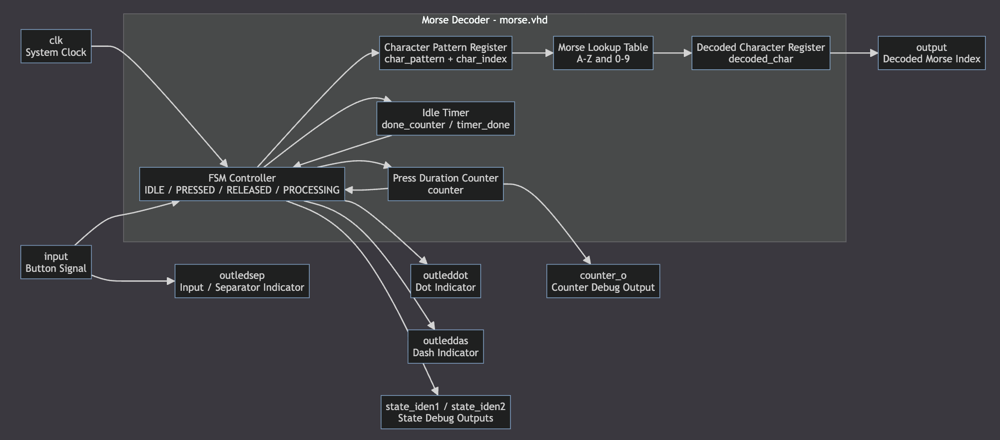
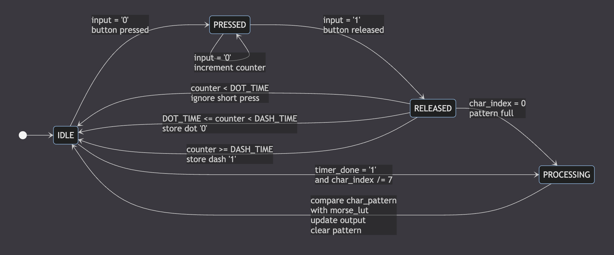
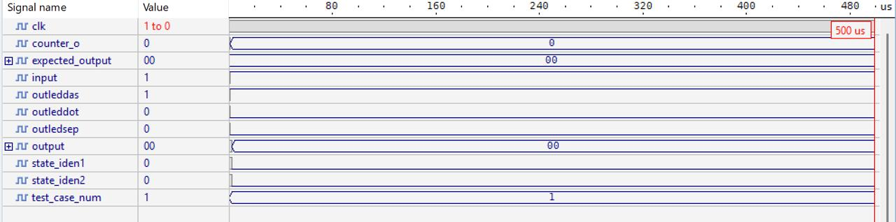
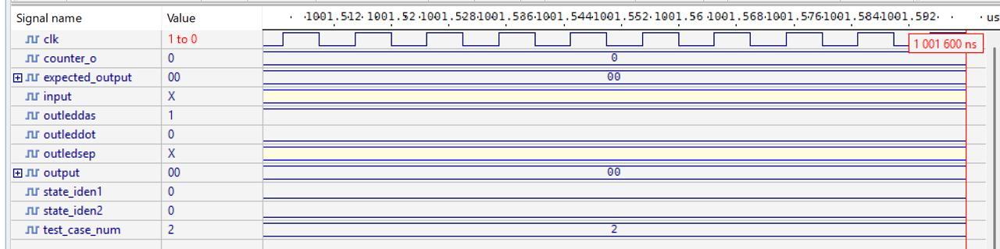

# گزارش پروژه دیکدر کد مورس با VHDL

## 1. روش الگوریتم موضوع

هدف این پروژه طراحی یک دیکدر کد مورس با استفاده از زبان VHDL است. در این سیستم، ورودی به صورت یک سیگنال دکمه دریافت می شود. مدت زمان فشرده بودن دکمه اندازه گیری شده و بر اساس آن مشخص می شود که ورودی یک نقطه، یک خط، یا یک فشار نامعتبر بوده است.

در کد مورس، هر حرف یا عدد از ترکیبی از نقطه ها و خط ها تشکیل می شود. در این طراحی، فشار کوتاه دکمه به عنوان نقطه و فشار طولانی تر به عنوان خط در نظر گرفته می شود. پس از دریافت دنباله ای از نقطه و خط، اگر برای مدت مشخصی ورودی جدیدی دریافت نشود، سیستم تشخیص می دهد که کاراکتر کامل شده است و وارد مرحله پردازش می شود.

مراحل کلی الگوریتم به صورت زیر است:

1. سیستم در حالت انتظار قرار دارد.
2. با فشرده شدن دکمه، شمارنده شروع به شمارش مدت زمان فشار می کند.
3. پس از رها شدن دکمه، مقدار شمارنده بررسی می شود.
4. اگر مدت فشار کمتر از حد نقطه باشد، ورودی نادیده گرفته می شود.
5. اگر مدت فشار در بازه نقطه باشد، مقدار `0` در الگوی کاراکتر ذخیره می شود.
6. اگر مدت فشار در بازه خط باشد، مقدار `1` در الگوی کاراکتر ذخیره می شود.
7. پس از پایان دریافت کاراکتر، الگوی ساخته شده با جدول کدهای مورس مقایسه می شود.
8. خروجی متناظر با حرف یا عدد تشخیص داده شده تولید می شود.

## 2. تحلیل کد

فایل اصلی طراحی در مسیر زیر قرار دارد:

`src/morse/morse.vhd`

در این فایل، موجودیت اصلی با نام `morse` تعریف شده است. این موجودیت دارای ورودی ساعت، ورودی دکمه و چند خروجی برای نمایش وضعیت سیستم است.

مهم ترین پورت های این ماژول عبارت اند از:

| نام سیگنال | نوع | توضیح |
|---|---|---|
| `clk` | ورودی | سیگنال کلاک سیستم |
| `input` | ورودی | ورودی دکمه برای دریافت کد مورس |
| `outleddot` | خروجی | فعال شدن هنگام تشخیص نقطه |
| `outleddas` | خروجی | فعال شدن هنگام تشخیص خط |
| `outledsep` | خروجی | نمایش وضعیت ورودی یا جداکننده |
| `state_iden1`, `state_iden2` | خروجی | نمایش وضعیت ماشین حالت برای بررسی و اشکال زدایی |
| `output` | خروجی | خروجی دیکد شده به صورت اندیس کاراکتر |
| `counter_o` | خروجی | مقدار شمارنده برای مشاهده در شبیه سازی |

در کد، سه ثابت زمانی اصلی تعریف شده است:

| ثابت | توضیح |
|---|---|
| `DOT_TIME` | حداقل زمان لازم برای تشخیص نقطه |
| `DASH_TIME` | حداقل زمان لازم برای تشخیص خط |
| `IDLE_TIME` | زمان سکوت لازم برای پایان یک کاراکتر |

ماشین حالت طراحی شامل چهار حالت اصلی است:

| حالت | توضیح |
|---|---|
| `IDLE` | حالت انتظار برای دریافت ورودی |
| `PRESSED` | حالت فشرده بودن دکمه و افزایش شمارنده |
| `RELEASED` | بررسی مدت زمان فشار و تشخیص نقطه یا خط |
| `PROCESSING` | مقایسه الگو با جدول مورس و تولید خروجی |

جدول `morse_lut` شامل الگوهای مربوط به حروف `A` تا `Z` و اعداد `0` تا `9` است. در این جدول، نقطه با `0` و خط با `1` نمایش داده شده است. بعد از تشکیل الگوی ورودی، سیستم آن را با مقادیر این جدول مقایسه کرده و اندیس متناظر را به خروجی می دهد.

## 3. نمودارها

### 3.1 نمودار بلوکی

نمودار بلوکی زیر ارتباط بین ورودی دکمه، ماشین حالت، شمارنده، ثبات الگوی کاراکتر، جدول مورس و خروجی دیکد شده را نشان می دهد.

### 3.2 نمودار ماشین حالت

ماشین حالت سیستم روند دریافت ورودی، تشخیص نقطه و خط، و پردازش نهایی کاراکتر را مشخص می کند.

## 4. شبیه سازی

برای بررسی عملکرد طراحی، از تست بنچ موجود در مسیر زیر استفاده شده است:

`testbench/morse/morse_tb.vhd`

تست بنچ وظیفه دارد ورودی های لازم را به طراحی اعمال کند. در این پروژه، تست بنچ سیگنال کلاک را تولید کرده و با تغییر دادن سیگنال `input`، فشرده شدن و رها شدن دکمه را شبیه سازی می کند.

در تست بنچ، چند رویه برای ساده تر شدن تولید ورودی تعریف شده است:

| رویه | توضیح |
|---|---|
| `press_button` | شبیه سازی فشرده شدن دکمه برای مدت مشخص |
| `send_dot` | ارسال یک نقطه |
| `send_dash` | ارسال یک خط |
| `send_char` | ارسال یک کاراکتر کامل مورس |

سناریوهای اصلی شبیه سازی شامل موارد زیر هستند:

| شماره تست | ورودی مورس | کاراکتر مورد انتظار | خروجی مورد انتظار |
|---|---|---|---|
| 1 | `.-` | A | 0 |
| 2 | `-...` | B | 1 |
| 3 | `...` | S | 18 |
| 4 | `...--` | 3 | 29 |
| 5 | فشار کوتاه نامعتبر | نامعتبر | نادیده گرفته می شود |
| 6 | `... --- ...` | SOS | S, O, S |

در شبیه سازی، سیگنال های زیر برای بررسی عملکرد سیستم مشاهده شدند:

| سیگنال | دلیل بررسی |
|---|---|
| `clk` | بررسی عملکرد سنکرون مدار |
| `input` | مشاهده الگوی ورودی مورس |
| `counter_o` | بررسی مدت زمان فشار دکمه |
| `outleddot` | تشخیص نقطه |
| `outleddas` | تشخیص خط |
| `state_iden1`, `state_iden2` | مشاهده وضعیت ماشین حالت |
| `output` | بررسی خروجی دیکد شده |

تصاویر زیر بخشی از نتایج شبیه سازی و شکل موج های تولید شده توسط تست بنچ را نشان می دهند:

## 5. نتایج شبیه سازی

نتایج شبیه سازی نشان می دهد که مدار می تواند مدت زمان فشرده بودن دکمه را اندازه گیری کرده و بر اساس آن نقطه یا خط را تشخیص دهد. پس از دریافت کامل یک الگوی مورس، سیستم وارد حالت پردازش شده و الگو را با جدول کدهای مورس مقایسه می کند.

جدول نتایج به صورت زیر است:

| ورودی | کاراکتر | خروجی مورد انتظار | خروجی مشاهده شده | نتیجه |
|---|---|---:|---:|---|
| `.-` | A | 0 | 0 | موفق |
| `-...` | B | 1 | 1 | موفق |
| `...` | S | 18 | 18 | موفق |
| `...--` | 3 | 29 | 29 | موفق |
| `---` | O | 14 | 14 | موفق |
| `... --- ...` | SOS | 18, 14, 18 | 18, 14, 18 | موفق |

در شکل های موج شبیه سازی، تغییرات سیگنال `input` نشان دهنده فشرده شدن و رها شدن دکمه است. همچنین مقدار `counter_o` مدت زمان فشار را نشان می دهد. پس از رها شدن دکمه، متناسب با مقدار شمارنده، خروجی های `outleddot` یا `outleddas` فعال می شوند. در پایان هر کاراکتر، پس از سپری شدن زمان سکوت، خروجی `output` مقدار دیکد شده را نمایش می دهد.

## 6. نتیجه گیری

در این پروژه، یک دیکدر کد مورس با استفاده از VHDL طراحی و بررسی شد. طراحی بر اساس ماشین حالت محدود انجام شده و شامل حالت های انتظار، فشرده بودن دکمه، رها شدن دکمه و پردازش کاراکتر است.

با استفاده از تست بنچ، چند ورودی مورس مختلف به مدار اعمال شد و نتایج شبیه سازی با مقادیر مورد انتظار مقایسه گردید. نتایج نشان دادند که طراحی قادر است الگوهای نقطه و خط را دریافت کرده و آن ها را به اندیس متناظر در جدول کد مورس تبدیل کند.

این طراحی می تواند در مراحل بعدی به ماژول های نمایشی مانند LED، سون سگمنت یا LCD متصل شود تا خروجی دیکد شده به صورت کاراکتر قابل مشاهده نمایش داده شود.
